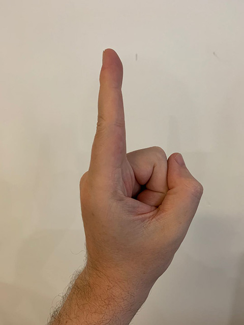
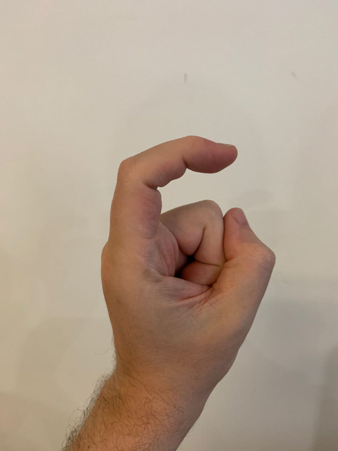
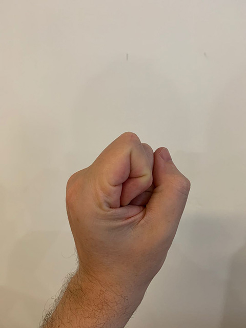

# **Hand Gesture Recognition**

Reconhecimento de gestos manuais utilizando TensorFlow.js e Fingerpose para interações avançadas baseadas em visão computacional.

## **Descrição**

Este projeto implementa um sistema de reconhecimento de gestos das mãos em tempo real, utilizando a biblioteca TensorFlow.js e o Fingerpose. Ele é capaz de identificar gestos como "rock", "paper", "scissors", "ok" e outros. Ideal para aplicações interativas ou jogos baseados em visão computacional.


## **Funcionalidades**

- Detecta gestos manuais em tempo real através da câmera.
- Gestos suportados:

  - **👍 Thumbs Up**
  - **✌️ Victory**
  - **✊️ Rock**
  - **🖐 Paper**
  - **👌 Ok**
  - **🙅‍♂️ Don't**

- Suporte a até 2 mãos simultâneas.
- Interface visual com feedback dos gestos reconhecidos.

## **Tecnologias Utilizadas**

- **Frontend**: HTML5, CSS3
- **Linguagem**: JavaScript (ES6+)
- **Bibliotecas**:
  - TensorFlow.js
  - MediaPipe Hands
  - Fingerpose

## **Instalação**

### **Pré-requisitos**

- Navegador compatível com WebGL (Google Chrome ou Microsoft Edge recomendados).
- Conexão à internet para carregar os modelos.
- Webcam funcional.

### **Passos para rodar o projeto localmente**

1. Clone este repositório:

```bash
git clone https://github.com/seu-usuario/hand-gesture-recognition.git
cd hand-gesture-recognition
```

2. Instalar dependências

```bash
  npm i ou npm install
```

3. Inicie o projeto.

```bash
  npm start ou npm run start
```

### **Como usar**:

1. Certifique-se de que sua webcam está funcionando.
2. Acesse a aplicação.
3. Posicione sua mão dentro do campo de visão da câmera.
4. Observe o feedback visual e o gesto detectado exibido na tela.

### **Estrutura do Projeto**

- index.html: Página principal com o layout da aplicação.
- src/scripts/index.js: Lógica principal de reconhecimento de gestos.
- src/scripts/gestures.js: Definição dos gestos e regras específicas para cada um.
- src/styles/styles.css: Estilização da interface.

### **Crie seus próprios gestos**

Você pode criar qualquer gesto de mão. Para ver como um gesto é descrito, dê uma olhada nos gestos de exemplos, se localiza em: [gesture.js](src/scripts/gestures.js)

Um gesto é definido descrevendo a curvatura esperada e a direção de cada dedo individualmente. Por exemplo, um gesto "Thumbs Up" (Polegar para Cima) é definido por um polegar esticado apontando para cima enquanto todos os outros dedos estão curvados e apontando para a esquerda ou para a direita 👍.

| Dedo | Nome                     |
| ---- | ------------------------ |
| 0    | Finger.Thumb (Polegar)   |
| 1    | Finger.Index (Indicador) |
| 2    | Finger.Middle (Médio)    |
| 3    | Finger.Ring (Anelar)     |
| 4    | Finger.Pinky (Mínimo)    |

| Curvatura | Nome                                     |
| --------- | ---------------------------------------- |
| 0         | FingerCurl.NoCur (Sem Curvatura)         |
| 1         | FingerCurl.HalfCurl (Curvatura Parcial)  |
| 2         | FingerCurl.HalfCurl (Curvatura Completa) |

Você pode consultar as imagens abaixo para ver um exemplo de como o dedo indicador é curvado: sem curvatura (no-curl), curvatura parcial (half curl) e curvatura completa (full curl).

|  |  |  |
| ------------------------------- | ----------------------------------- | ----------------------------------- |
| No curl                         | Half curl                           | Full curl                           |

| Direção | Nome                   |
| ------- | ---------------------- |
| 0       | Vertical Up 👆         |
| 1       | Vertical Down 👇       |
| 2       | Horizontal Left 👈     |
| 3       | Horizontal Right 👉    |
| 4       | Diagonal Up Right ↗️   |
| 5       | Diagonal Up Left ↖️    |
| 6       | Diagonal Down Right ↘️ |
| 7       | Diagonal Down Left ↙️  |

Exemplo: Gesto de Rock row 🤘

1. Primeiro, crie um novo objeto GestureDescription

```
const RockRowGesture = new GestureDescription('rock-row');
```

2. Espeque que o Polegar, Indicador e Mínimo esteja esticado estejam esticados

```
RockRowGesture.addCurl(Finger.Thumb, FingerCurl.NoCurl, 1.0);
RockRowGesture.addCurl(Finger.Index, FingerCurl.NoCurl, 1.0);
RockRowGesture.addCurl(Finger.Pinky, FingerCurl.NoCurl, 1.0);
```

3. Espera-se que todos os outros dedos estejam completamente curvados. Para esse gesto, não importa para qual direção os dedos curvados estão apontando, portanto, apenas a descrição da curva é adicionada.

```
for (const finger of [
  Finger.Middle, Finger.Ring
]) {
  RockRowGesture.addCurl(finger, FingerCurl.FullCurl, 1.0);
  RockRowGesture.addCurl(finger, FingerCurl.HalfCurl, 1.0);
}
```

4. Adicione na lista de gestos

```
const gestures = [
  RockGesture, PaperGesture, ScissorsGesture, DontGesture, OkGesture, RockRowGesture
]
```

5. Navegue até o arquivo [gesture.js](src/scripts/index.js) e adicione seu gesto

```
const gestureStrings = {
  'thumbs_up': '👍',
  'victory': '✌️',
  'rock': '✊️',
  'paper': '🖐',
  'scissors': '✌️',
  'dont': '🙅‍♂️',
  'ok': '👌',
  'rock-row': '🤘',
}
```

### **Contribuições**

Contribuições são bem-vindas! Sinta-se à vontade para abrir uma issue ou enviar um pull request.

1. Faça um fork do projeto.
2. Crie uma branch com sua feature (git checkout -b feature/nova-feature).
3. Commit suas mudanças (git commit -m 'Adiciona nova feature').
4. Envie sua branch (git push origin feature/nova-feature).
5. Abra um Pull Request no repositório original.
